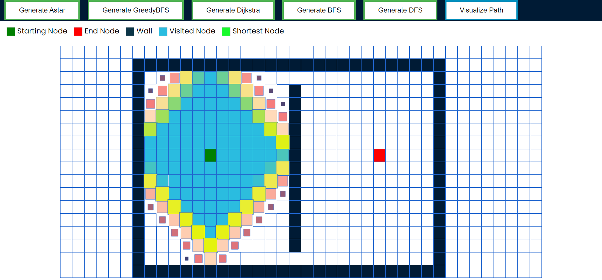
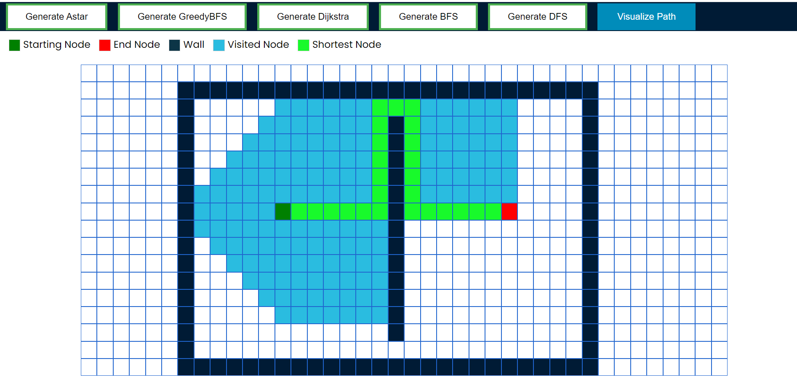

# Grid-Pathfinding-Visualizer

**A web application to visualize various pathfinding algorithms on a Grid**

## Installation

#### Cloning the repository:

- Clone the repository using `git clone https://github.com/mesharyachoudhary/Grid-Pathfinding-Visualizer.git`.

#### Installing dependencies:

- Run `npm install`

## Starting the server:

- Run `npm start`.
- Open http://localhost:3000 to view it in the browser.

 
## Positioning the start and end node

_You can move the start and end node to which ever cell you want by dragging and dropping_

## Adding walls

- _You can add walls to which ever cells you want by clicking the mouse and dragging it and the same goes for removing them_
- _You can also toggle between wall cell and normal cell_

## Generation of Path

_Generate the path using whichever algorithm you want by clicking on the corresponding button_

## Visualization of Path

_Visualize the generated path by clicking the Visualize Path Button_

## For example these are the visualized paths for the A-Star,Greedy Best First Search and Dijkstra Algorithm

_Dijkstra in the midst of visualization_

_A Star_

_Greedy Best First Search_

## After visualization

- _After visualization you can reposition start and end node as you want and add and delete walls as you wish and visualize using any algorithm again without reloading the webpage_

- _We moved the start node out of that square and removed one of the walls_
  

_This Project was built by_

- [Mesharya M Choudhary](https://github.com/mesharyachoudhary)
- [Akshat Arun](https://github.com/akshatarun)
